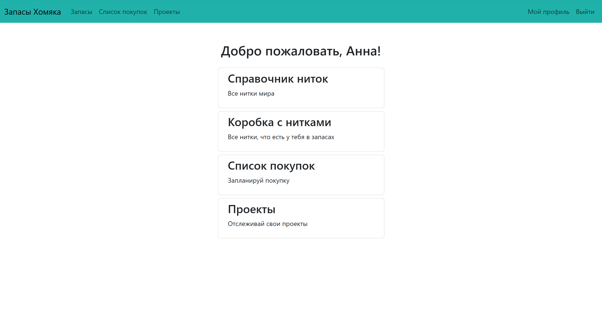
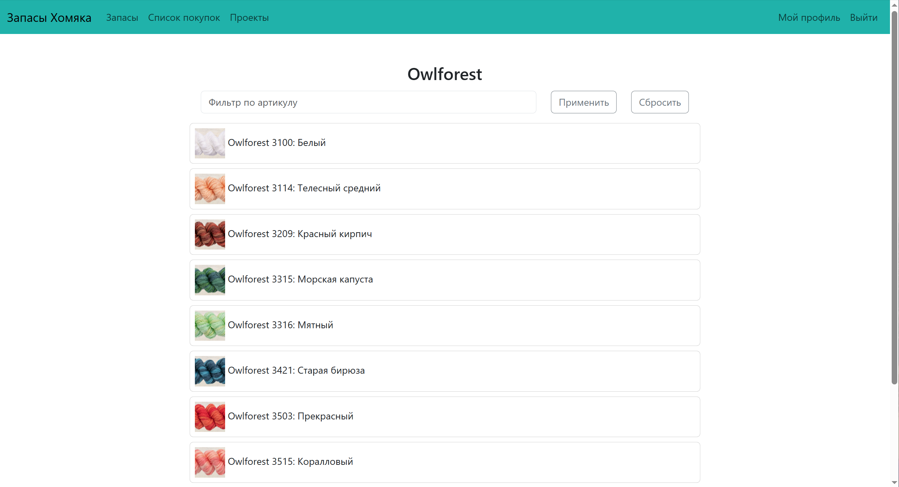
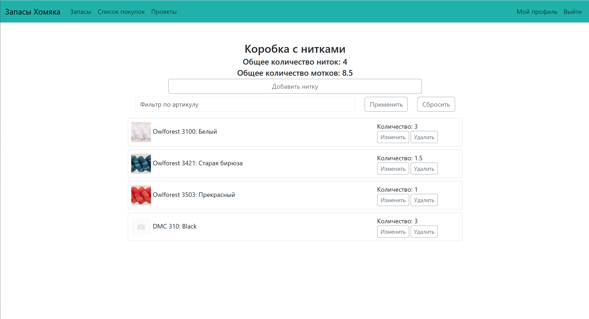
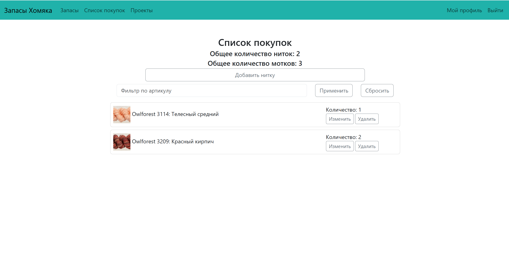
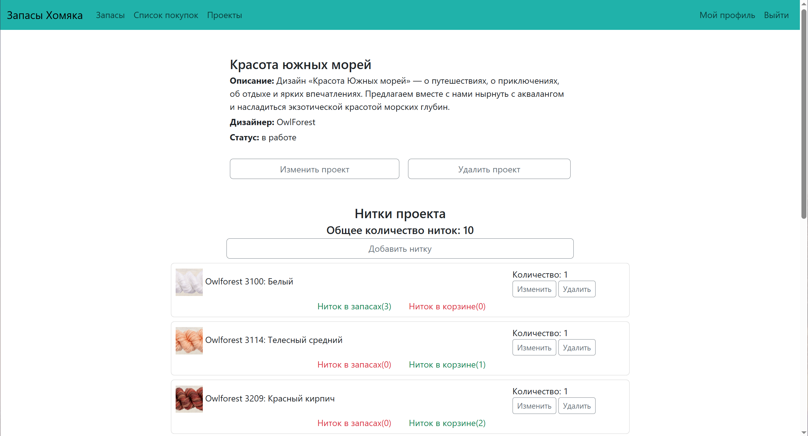

# 🐹 Запасы Хомяка

Веб-приложение на Django для учёта коллекции ниток мулине, планирования вышивальных проектов и формирования списка покупок.

Проект разработан как итоговый проект курса **«Python-разработчик»** и демонстрирует работу с Django, PostgreSQL, Django ORM, формами, сервисным слоем и автоматизированным тестированием.

---

## 📌 Возможности

Приложение позволяет пользователю:

- регистрироваться и авторизоваться;
- редактировать данные профиля;
- просматривать справочник производителей и ниток;
- просматривать подробную информацию о конкретной нитке;
- вести собственный запас ниток;
- добавлять и изменять количество ниток в запасе;
- формировать список ниток, которые необходимо купить;
- создавать вышивальные проекты;
- указывать нитки и необходимое количество для каждого проекта;
- изменять статус проекта;
- фильтровать нитки по артикулу;
- просматривать количество ниток, доступных в запасе и находящихся в списке покупок;
- просматривать использование конкретной нитки в проектах.

Каждый пользователь работает только со своими запасами, корзиной и проектами.

---
## 📸 Скриншоты

### Главная страница

<p align="center">
  
</p>

### Каталог ниток

<p align="center">
  
</p>

### Запасы и список покупок

<p align="center">
  
  
</p>

### Вышивальный проект

<p align="center">
  
</p>
---

## 🛠 Стек

### Backend

- **Python 3.14**
- **Django 6.0.5**
- **PostgreSQL**
- **Django ORM**

### Работа с данными

- `ForeignKey`
- `OneToOneField`
- `UniqueConstraint`
- `CheckConstraint`
- `select_related`
- `Subquery`
- `OuterRef`
- `Coalesce`
- агрегатные функции `Count` и `Sum`

### Forms

- Django Forms
- Django ModelForm
- `ModelChoiceField`
- собственное поле `PositiveQuantityField`

### Тестирование

- **pytest**
- **pytest-django**
- **pytest-cov**
- фикстуры pytest
- тестирование моделей, форм, сервисов и views

### Инструменты

- **Poetry**
- `python-dotenv`
- Pillow
- Django Debug Toolbar
- **Flake8**

---

## 🏗 Архитектура проекта

Основное приложение находится в директории `app/`.

```text
app/
├── hamster_stocks/
│   ├── settings/
│   │   ├── base.py
│   │   ├── dev.py
│   │   └── prod.py
│   ├── urls.py
│   ├── asgi.py
│   └── wsgi.py
│
├── threads/
│   ├── models/
│   │   ├── threads.py
│   │   ├── stock.py
│   │   ├── basket.py
│   │   └── project.py
│   ├── views/
│   │   ├── index.py
│   │   ├── threads.py
│   │   ├── stock.py
│   │   ├── basket.py
│   │   └── project.py
│   ├── forms.py
│   ├── fields.py
│   ├── services.py
│   ├── templatetags/
│   ├── migrations/
│   └── tests/
│
├── users/
│   ├── forms.py
│   ├── views.py
│   └── tests/
│
├── fixtures/
├── templates/
├── static/
├── media/
├── manage.py
├── pyproject.toml
├── poetry.lock
└── pytest.ini
```

### Разделение ответственности

В проекте используется разделение логики по уровням:

```text
Models
   ↓
Forms
   ↓
Views
   ↓
Services
   ↓
Database
```

**Models** отвечают за структуру и ограничения данных.

**Forms** отвечают за валидацию пользовательского ввода.

**Views** обрабатывают HTTP-запросы, проверяют права доступа и координируют выполнение операции.

**Services** содержат переиспользуемую бизнес-логику, например добавление нитки в запас или корзину.

---

## 🗃 Основные модели

### Manufacturer

Производитель ниток.

```text
Manufacturer
    │
    └── Thread
```

У производителя может быть несколько видов ниток.

---

### Thread

Центральная модель приложения.

Содержит:

- артикул;
- название;
- производителя;
- изображение.

Для пары:

```text
article + manufacturer
```

установлено уникальное ограничение.

---

### Stock

Персональный запас ниток пользователя.

Связан с пользователем через `OneToOneField`.

```text
User 1 ─── 1 Stock
```

---

### Basket

Персональный список покупок пользователя.

```text
User 1 ─── 1 Basket
```

---

### Project

Вышивальный проект пользователя.

```text
User 1 ─── N Project
```

Проект содержит:

- название;
- описание;
- дизайнера;
- статус;
- необходимые нитки.

---

### Связующие модели

Для хранения количества ниток используются отдельные модели:

```text
StockThread
BasketThread
ProjectThread
```

Например:

```text
Stock
  │
  └── StockThread ─── Thread
```

Для каждой такой связи установлен `UniqueConstraint`, поэтому одна и та же нитка не может появиться дважды в одном хранилище.

---

## 🔐 Безопасность

Безопасность доступа к данным является отдельной частью проекта.

### Проверка владельца

Пользователь может работать только со своими объектами.

Например, при получении проекта используется проверка владельца:

```python
get_object_or_404(
    Project,
    pk=project_id,
    owner=request.user,
)
```

Для связанных объектов используется проверка через связи:

```python
get_object_or_404(
    ProjectThread,
    pk=project_thread_id,
    project__owner=request.user,
)
```

Аналогичные проверки реализованы для запасов и списка покупок.

Это защищает приложение от **горизонтального повышения привилегий**, когда пользователь пытается получить доступ к объекту другого пользователя.

---

### Защита данных на уровне БД

Для количества ниток используются ограничения:

```text
quantity >= 0.01
```

Они реализованы через Django `CheckConstraint`.

Также используются уникальные ограничения для связей:

```text
Stock + Thread
Basket + Thread
Project + Thread
```

Таким образом, корректность данных контролируется не только формами Django, но и самой базой данных.

---

### Production settings

Для production предусмотрены отдельные настройки:

```text
hamster_stocks/settings/
├── base.py
├── dev.py
└── prod.py
```

В production отключён `DEBUG` и включены настройки безопасности:

- secure session cookies;
- secure CSRF cookies;
- HTTPS redirect;
- защита от MIME-sniffing;
- `same-origin` referrer policy.

Секретные данные загружаются из переменных окружения.

---

## 🧩 Валидация количества ниток

Для количества используется собственное поле:

```python
class PositiveQuantityField(forms.FloatField):
    def __init__(self, *args, **kwargs):
        kwargs.setdefault('min_value', 0.01)
        super().__init__(*args, **kwargs)
```

Это позволяет не допускать значения:

```text
0
-1
0.001
```

при вводе через формы.

Дополнительно те же ограничения продублированы на уровне PostgreSQL через `CheckConstraint`.

Так приложение использует два уровня защиты:

```text
Form validation
       ↓
Database constraint
```

---

## 🔎 Работа с Django ORM

В проекте используются более продвинутые возможности Django ORM.

Например, при отображении проекта необходимо получить количество каждой необходимой нитки:

- в запасе пользователя;
- в его списке покупок.

Для этого используются:

```python
OuterRef
Subquery
Coalesce
```

`Coalesce` позволяет вернуть `0`, если соответствующей нитки нет в запасе или корзине, вместо `None`.

Также для уменьшения количества SQL-запросов используется `select_related`.

---

## ⚙️ Сервисный слой

Повторяющаяся бизнес-логика вынесена из views в `services.py`.

Например, функция добавления нитки в хранилище:

```python
add_thread_in_storage(...)
```

используется для разных типов хранилищ:

```text
StockThread
BasketThread
ProjectThread
```

Если нитка уже существует в хранилище, её количество увеличивается.

Если записи нет — создаётся новая.

Такой подход позволяет не дублировать одинаковую бизнес-логику в нескольких views.

---

# 🚀 Установка и запуск

## 1. Клонировать репозиторий

```bash
git clone https://github.com/Vimpleks/django-hamster-stocks.git
cd django-hamster-stocks
```

Перейти в директорию приложения:

```bash
cd app
```

---

## 2. Установить Poetry

Если Poetry ещё не установлен, установите его согласно официальной документации.

Проверить установку:

```bash
poetry --version
```

---

## 3. Установить зависимости

```bash
poetry install
```

Poetry установит зависимости проекта из `pyproject.toml` и `poetry.lock`.

---

## 4. Создать PostgreSQL database

Создайте базу данных PostgreSQL, например:

```bash
createdb hamster_stocks
```

При необходимости базу можно создать через `psql` или любой графический клиент PostgreSQL.

---

## 5. Настроить переменные окружения

В директории `app` находится файл:

```text
.env.example
```

Создайте на его основе `.env`:

```bash
cp .env.example .env
```

Для Windows можно просто создать файл `.env` вручную и перенести в него необходимые значения.

Пример:

```env
ALLOWED_HOSTS=localhost,127.0.0.1

SECRET_KEY=your-secret-key
DB_NAME=hamster_stocks
DB_USER=your-database-user
DB_PASSWORD=your-database-password
DB_HOST=localhost
DB_PORT=5432
```

> Файл `.env` не должен добавляться в Git.

---

## 6. Применить миграции

```bash
poetry run python manage.py migrate
```

---

## 7. Загрузить тестовые данные

В проекте предусмотрены Django fixtures.

Для загрузки справочника производителей:

```bash
poetry run python manage.py loaddata fixtures/threads/manufacturer.json
```

Для загрузки ниток:

```bash
poetry run python manage.py loaddata fixtures/threads/thread.json
```

При необходимости можно загрузить остальные демонстрационные данные:

```bash
poetry run python manage.py loaddata fixtures/threads/stock.json
poetry run python manage.py loaddata fixtures/threads/stockthread.json
poetry run python manage.py loaddata fixtures/threads/basket.json
poetry run python manage.py loaddata fixtures/threads/basketthread.json
poetry run python manage.py loaddata fixtures/threads/project.json
poetry run python manage.py loaddata fixtures/threads/projectthread.json
```

---

## 8. Создать суперпользователя

```bash
poetry run python manage.py createsuperuser
```

---

## 9. Запустить сервер

```bash
poetry run python manage.py runserver
```

После запуска приложение будет доступно по адресу:

```text
http://127.0.0.1:8000/
```

Административная панель:

```text
http://127.0.0.1:8000/admin/
```

---

# 🧪 Тестирование

Для запуска всех тестов:

```bash
poetry run pytest -v
```

Для краткого вывода:

```bash
poetry run pytest -q
```

Для запуска с измерением покрытия:

```bash
poetry run pytest --cov
```

Тесты находятся в:

```text
threads/tests/
users/tests/
```

Проверяются:

- модели;
- формы;
- сервисный слой;
- views;
- авторизация;
- права доступа;
- ограничения базы данных;
- валидация количества;
- уникальность связей;
- обработка некорректных данных;
- ORM-аннотации;
- сценарии доступа к объектам другого пользователя.

Текущая версия проекта проходит:

```text
192 passed
```

---

# 📊 Что демонстрирует проект

Проект демонстрирует следующие навыки:

### Python

- работа с функциями;
- аннотации типов;
- исключения;
- работа с модулями;
- переиспользование кода.

### Django

- модели;
- миграции;
- forms / ModelForm;
- authentication;
- decorators;
- function-based views;
- templates;
- URL routing;
- Django Admin;
- static/media files;
- settings для разных окружений.

### Django ORM

- `ForeignKey`;
- `OneToOneField`;
- `select_related`;
- `filter`;
- `aggregate`;
- `Count`;
- `Sum`;
- `OuterRef`;
- `Subquery`;
- `Coalesce`;
- database constraints.

### Testing

- pytest;
- pytest-django;
- fixtures;
- позитивные сценарии;
- негативные сценарии;
- тестирование прав доступа;
- тестирование ограничений БД;
- тестирование бизнес-логики;
- **flake8** — проверка качества и стиля кода

### PostgreSQL

- работа с реляционной БД;
- внешние ключи;
- ограничения целостности;
- уникальные ограничения;
- проверки данных на уровне БД.

---

# 📁 Дополнительные материалы

В репозитории также находится ER-диаграмма базы данных проекта:

```text
diagramm_hamster/
```

Она представлена в форматах:

- `.drawio`
- `.pdf`

---

# 🔮 Возможные дальнейшие улучшения

Проект можно расширять в следующих направлениях:

- добавить REST API на Django REST Framework;
- добавить Docker и Docker Compose;
- добавить поиск по нескольким параметрам;
- добавить импорт справочника ниток;
- добавить экспорт списка покупок.

---

# 👩‍💻 О проекте

Проект создан в рамках обучения Python/Django и предназначен для демонстрации навыков backend-разработки, работы с базами данных, проектирования бизнес-логики и автоматизированного тестирования.